# Cookify
Cookify est une plateforme dédiée aux amateurs de cuisine à la recherche de recettes responsables et accessibles.
# Choix du sujet
Nous avons choisi de créer Cookify en raison de la montée en popularité des plateformes culinaires en ligne et de l'engouement croissant pour la cuisine maison. Nous sommes dans un monde où l'alimentation saine, diversifiée et respectueuse de l'environnement prend une place importante. Il nous semble alors essentiel de donner à tout le monde l'opportunité de pouvoir trouver des recettes à leur goût et respectant leur valeurs. Ce prototype vise donc à fournir des idées que les plateformes majeures pourraient intégrer pour offrir des options plus durables et éco-responsables.
# Utilité sociale
L’utilité sociale des plateformes de partage de recettes réside dans leur capacité à offrir une alternative plus accessible et plus diversifiée aux recettes que nous cuisinons au quotidien. Ces plateformes permettent à chacun d'explorer différentes cultures culinaires, favorisent des habitudes alimentaires saines et responsables, et renforcent les liens entre utilisateurs du monde entier. En particulier, ces plateformes permettent :
- d'explorer les cultures à travers la cuisine et le partage de savoir-faire,
- d'encourager des habitudes alimentaires saines et responsables,
- de renforcer les liens entre les utilisateurs grâce aux interactions et au partage de recettes,
- d'offrir une plateforme allégée, sans publicité, qui met en avant l'essentiel pour l'utilisateur.
# Effet de la numérisation
L'impact de la numérisation sur le partage de recettes est double. En remplaçant les livres de cuisine par des services en ligne, nous facilitons l'accès à une vaste base de données de recettes, tout en augmentant la consommation de ressources numériques. Pour bien comprendre cet équilibre, il est intéressant de comparer l'empreinte carbone d'une consultation numérique à celle d'une consultation dans un livre de recettes. Selon une étude, la fabrication d'un livre de 300 pages émet environ 1,3 kg de CO₂ ([youmatter](https://youmatter.world/fr/categorie-environnement/liseuse-livre-ecologique-impact-environnement/)). La fabrication d'un livre a un coût environnemental initial important, nécessitant du papier, de l'encre et de l'énergie pour l'impression et le transport. Toutefois, ce coût est divisé par le nombre de consultations au cours de son cycle de vie, rendant le livre souvent plus favorable sur le long terme, surtout lorsqu'il est utilisé fréquemment et partagé entre plusieurs personnes.

En revanche, les sites web culinaires nécessitent de l'énergie à chaque consultation, impliquant l'utilisation d'appareils électroniques et de serveurs. L'empreinte carbone d'une page web dépend de sa conception, de son hébergement et des pratiques des utilisateurs. Les consultations répétées et le temps passé en ligne peuvent augmenter cet impact, bien que des optimisations (comme la compression des images et la réduction des requêtes) puissent réduire la consommation énergétique.

Ce prototype vise cependant à inspirer une approche plus éco-responsable des services existants en mettant l'accent sur les avantages suivants :

- un accès facilité à une large base de recettes, disponible à toute heure et partout dans le monde,
- le développement de communautés culinaires en ligne, encourageant les échanges de savoirs et de conseils,
- une incitation à une utilisation raisonnable grâce à des fonctionnalités éco-responsables (algorithmes optimisés, recherche rapide),
- une réduction de l’empreinte carbone numérique par la sensibilisation des utilisateurs à des pratiques durables (réduction du temps de navigation, gestion optimisée des ressources).

En présentant ces différents apports, les plateformes culinaires numériques peuvent être perçues comme une évolution utile, à condition d’intégrer une véritable réflexion sur leur impact environnemental et de chercher constamment à l'optimiser.
# Scénarios d'usage et impacts
Nous partons de l'hypothèse que les utilisateurs visitent les sites de recettes principalement dans le but de découvrir de nouvelles idées de repas, de trouver des recettes spécifiques, ou de s'inspirer pour leur prochain repas. Ces visites peuvent se produire à tout moment de la journée, notamment lors de pauses ou pendant la préparation des repas.
<!-- # Scénario 1 : "Consulter la liste recettes de la page d'accueil"
1. L’utilisateur se rend sur le site internet
2. L’utilisateur accède à la page d'accueil où sont affichés un certains nombre de recette
3. L'utilisateur consulte toute les recettes de page d'accuei en scrollant en bas de la page -->
# Scénario 1 : "L'utilisateur souhaite consulter une recette"
1. L'utilisateur se rend sur la page d'accueil
2. Il regarde la liste des recettes qui lui sont proposées
3. Il choisit une recette et il l'a consulte
4. Il retourne à la page d'accueil
# Scénario 2 : "L'utilisateur souhaite consulter une recette en particulier"
1. L'utilisateur se rend sur la page d'accueil
2. Il recherche une recette en particulier dans l'index ou dans la barre de recherche
3. Il consulte la recette
4. Il retourne à la page d'accueil
# Impact de l'exécution des scénarios auprès de différents services concurrents
L'EcoIndex d'une page (de A à G) est calculé (sources : EcoIndex, Octo, GreenIT) en fonction du positionnement de cette page parmi les pages mondiales concernant :
- le nombre de requêtes lancées,
- le poids des téléchargements,
- le nombre d'éléments du document.

Nous avons choisi de comparer l'impact des scénarios sur les sites de cuisine principaux suivants:
- Marmiton
- Cuisine AZ
- PtitChef

Vous pouvez accéder au résultat en cliquant sur le lien suivant (attention, d'une journée à l'autre, on peut observer une certaine variabilité) : [résultats](https://htmlpreview.github.io/?https://raw.githubusercontent.com/UTT-GL03/Cookify/refs/heads/main/benchmarks/results.html)

A partir de ces résultats, plusieurs remarques peuvent être pertinente. 
**Premièrement, on peut identifier les sources d'inmpact:**

Taille des Pages Web : Des pages volumineuses nécessitent plus de ressources pour le chargement, augmentant ainsi la consommation d'énergie.

Nombre de Requêtes HTTP : Un nombre élevé de requêtes sollicite davantage les serveurs et prolonge le temps de chargement, ce qui accroît l'empreinte carbone.

Utilisation d'Images Non Optimisées : Des images de grande taille ou mal compressées augmentent la taille des pages et la consommation de bande passante.

Scripts et Feuilles de Style Non Minifiés : Des fichiers JavaScript et CSS non optimisés alourdissent les pages et ralentissent leur chargement.

**Deuxièmement, on peut identifier le caractère évitable de ces impacts.** 

On remarque notamment que la majorité de ces impacts peuvent être réduits grâce à des pratiques d'écoconception web :

Optimisation des Images : Compresser les images et utiliser des formats adaptés réduit significativement leur poids.

Minification des Fichiers : Réduire la taille des fichiers CSS et JavaScript en supprimant les espaces inutiles et les commentaires améliore les performances.

Réduction des Requêtes HTTP : Combiner les fichiers CSS et JavaScript, utiliser des sprites pour les images et limiter les ressources externes diminuent le nombre de requêtes.

Mise en Cache Efficace : Configurer correctement les en-têtes de cache permet de réduire les requêtes répétées et d'accélérer le chargement des pages.

En adoptant ces pratiques, il serait théoriquement possible de diminuer l'impact environnemental de ces sites webs.

**Maquette de l'interface et échantillon de données**

Au vu des différents services comparés, des exigences environnementales exprimées plus haut et des scénarios retenus, nous avons défini pour notre prototype une maquette de l'interface et un échantillon de données réalistes.

L'interface retenue est composée de trois types de "pages Web" :

- la page d'accueil composée des types de programme de recette (Pour le sport, pour les végétariens, pour le plaisir,etc...),
- la page composée des recettes disponibles d'un des programmes,
- La page d'une recette.

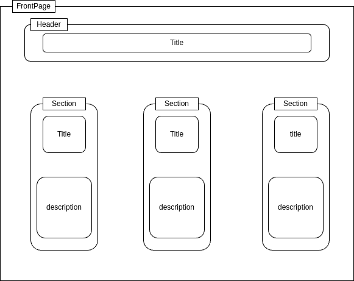
__Fig.1__: Maquette de la page d'accueil

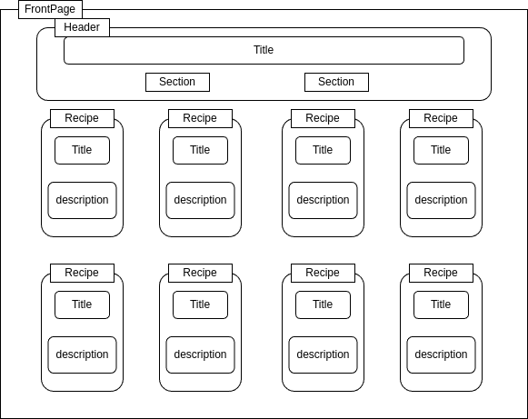
__Fig.2__: Maquette de la liste de recette après avoir cliqué sur un programme 

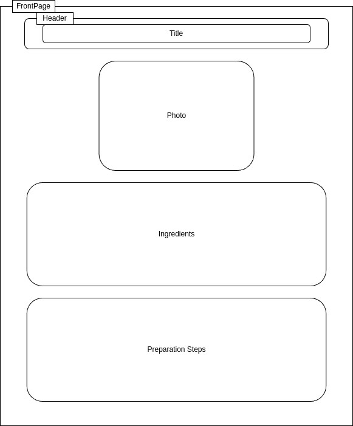
__Fig.3__: Maquette d'une recette

Pour des raisons de respect des droits d'auteurs, nous utilisons des données générées (avec [`dummy-json`](https://dummyjson.com)).
Bien que fictives, ces données correspondent à la structure des services concurrents : 10 recettes comportant un titre, son programme, son temps de préparation, sa difficulté, ses ingrédients et ses étapes(voir [modèle de données](./frontend/sample_data.hbs)). 
Dans un objectif de sobriété environnementale, les photos ont été limités au maximum et le nombres de recettes limités à 30 par programme.

# Prototype n°1 : Fonctionnalités pour le scénario prioritaire avec données statiques

Pour cette première version du prototype :

- l'échantillon de données est encore chargé dans le code de manière statique,
- les fonctionnalités implémentées ne sont que celles nécessaires pour suivre le scénario prioritaire ("Lire une recette").

# Page de selection des categories

La page de sélection des catégories est conçue pour offrir aux utilisateurs un point d'entrée intuitif vers les différentes recettes disponibles en fonction de leurs préférences ou besoins. Dans cette page nous avons fait le choix de ne pas inclure d'image afin de rendre la page plus légère et plus respectueuse de l'environnement.

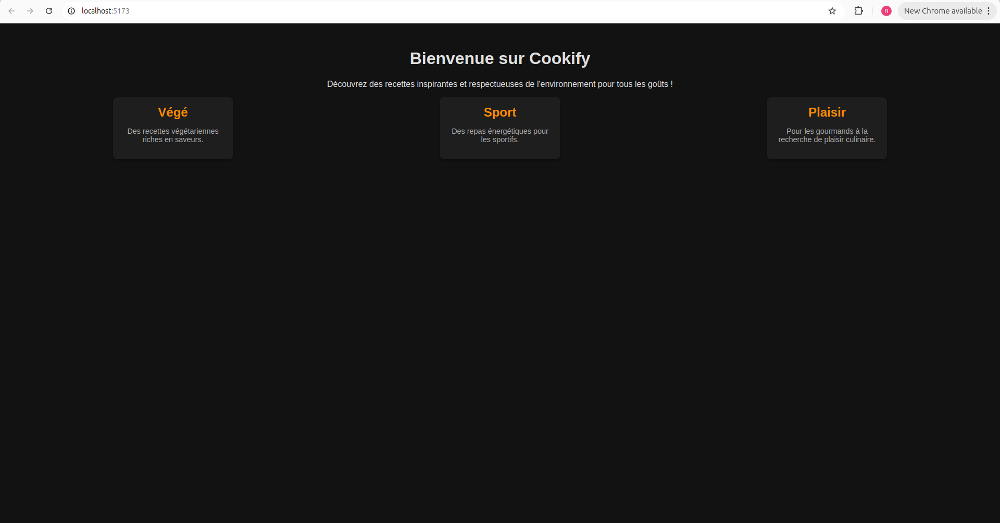
__Fig.4__: Page de choix des categories

# Page de présentation des différentes recettes

Nous avons développé la page d'accueil pour qu'elle affiche l'échantillon de données sous une forme proche de ce que prévoyait la maquette.

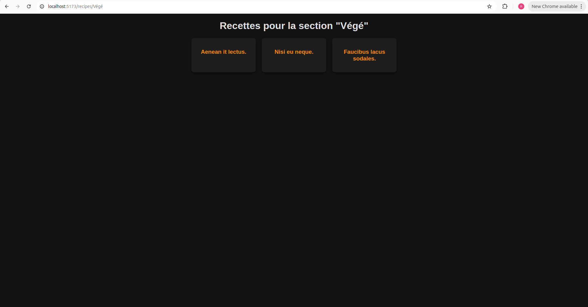
__Fig.5__: Page d'accueil

Pour l'intant, notre design est minimaliste. Dans la suite du projet, nous verrons si l'impact environnemental du passage à un framework de mise en page plus puissant (comme Bootstrap) est acceptable.

De même, nous avons décidé, contrairement à l'ensemble des services concurrents, de ne pas inclure de photographies dans cette page. Même si ces photographies ont probablement un impact sur l'attention portée à une recette, elles ne sont pas strictement requises pour la consultation des recettes et ne sont donc pas incluses dans le produit minimum viable. Si une telle fonctionnalité devait par la suite être introduite, il faudrait mettre en balance son utilité et son impact a priori important. En effet, à moins de mettre en place des techniques avancées d'optimisation (et possiblement ambivalentes) comme les sprites en CSS ou le multiplexage dans HTTP/2 (cf. Wikipédia), une requête supplémentaire est nécessaire pour chaque image.

Dans l'état actuel du prototype, il est possible d'avoir une première idée de l'impact environnemental du frontend. Bien entendu, il manque encore le chargement dynamique des données, mais nous pouvons déjà évaluer l'impact de l'affichage des données et du framework (au sens large : React, DayJS). Cette évaluation de l'impact (cf. Tab.1) est déjà encourageante en mode "développement" mais encore plus en mode "pré-production". Nous mesurons ici l'effet positif de l'adoption d'outils de développement Web intégrant la "minification" (cf. Wikipédia) du code et la concaténation du code d'une part et des feuilles de style d'autre part.

|   | EcoIndex| GES (gCO2e) | Taille du DOM | Requêtes | Taille de la page (ko)
|---|--------:|------------:|--------------:|---------:|---------------------:
| Mode "développement"  | 85.20 A🟢 |  1.30 | 28 | 23 | 1523
| Mode "pré-production" | 95.56 A🟢 | 1,09 | 23 | 5 | 59

__Tab.1__: Évaluation de l'impact du prototype de la page d'accueil.

# Pages d'information d'une recettes

Les pages des recettes ont pour HTTP-URI `/{id}`.
Comme l'écahntillon de données ne comportait pas d'identifiants pour les recettes, nous avons adopté pour l'intant leur titre en tant qu'identifiant.

De même que précédemment, nous avons tenté d'implémenter cette page (cf. Fig. 3) conformément à ce que prévoyait la maquette.

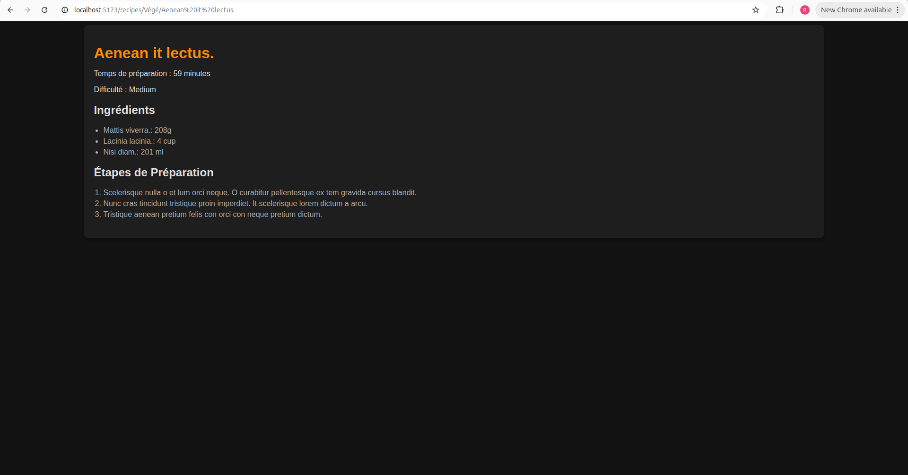
__Fig.6__: Page de la recette

Avec l'ajout de ce modèle de page et la mise en place de la navigation entre les deux modèles, il devient possible d'exécuter le scénario prioritaire complet et de mesurer son impact.

|   | EcoIndex| GES (gCO2e) | Taille du DOM | Requêtes | Taille de la page (ko)
|---|--------:|------------:|--------------:|---------:|---------------------:
| 1. Choisir la categorie 					   | 95.69 A🟢 | 1,09 | 23 | 4 | 59
| 2. Choisir et lire une recette 			   | 95.69 A🟢 | 1,09 |  23 | 4 | 59
| 3. Revenir à la page de choix des categories	| 95.69 A🟢 | 1,09 | 23 | 4 | 59

__Tab.2__: Évaluation de l'impact du scénario "Lire des recettes parmi les recettes du jour" dans le prototype n°1.

Ces estimations bien qu'artificiellement basses (puisque les données sont chargées de manière statique) sont tout de même à comparer avec celle des site différents

Si nous arrivons à maintenir les émissions en dessous de 1,5 g pour notre produit minimum viable, nous pouvons donc espérer proposer une alternative 2 à 3 fois moins impactante que les services existants.

## Prototype n°2 : Fonctionnalités pour le scénario prioritaire avec données statiques chargées de manière dynamique

Pour cette deuxième version du prototype, les données (toujours statiques) sont désormais chargées par le *frontend* à travers le réseau immédiatement après un premier affichage à vide.
Ce comportement, plus réaliste, n'a pour effet qu'une requête supplémentaire par page affichée.

Concernant l'évaluation de l'impact environemental du scénario, par rapport au tableau précédent (cf. Tab.2), à l'exception du nombre de requêtes qui est incrémenté de 1, les résultats sont strictement identiques. D'ailleurs, à partir de cette version, et à moins de changements profonds, l'EcoIndex ne devrait plus évoluer de manière significative. Nous utiliserons désormais un autre logiciel, GreenFrame, qui évalue non pas l'impact "environné" de la consultation (incorporant une participation au cycle de vie du terminal) mais celui de la consultation proprement dite (cf. Tab.3) et de manière beaucoup plus fiable à partir des statistiques d'utilisation des ressources physiques (CPU, mémoire, réseau, disque).

| | Impact de la consultation des recettes | Impact de la consultation d'une recette
|--------------|----:|---------:
| Papilles et pupilles  | 72     | 92
| Cuisine Actuelle   | 65     | 92
| PtitChef     | 138     | 151
| CuisineAZ     | 60     | 69
| Marmiton   | 94      | 115
| __Cookify__ | __31__  | __31__

__Tab.3__ : Impact en mg CO2e de la consultation proprement dite des pages des services existants et de notre prototype.

Pour les services existants, sur le graphique présentant l'utilisation dans le temps des ressources (cf. Fig.4), on constate d'autres pics que le pic initial, probablement associés au chargement et à l'affichage de contenus multimédias et de publicités, ou causés par des techniques de pistage sur le Web.

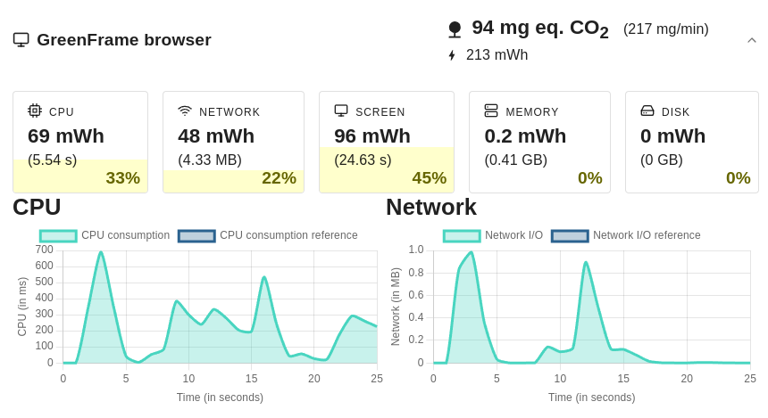
__Fig.4__: Consommation de ressource lors de la consultation de la page des recettes de *Marmiton*.

Pour notre prototype, au contraire, le graphique (cf. Fig.5) présente un pic significatif de consommation de CPU et de réseau. Les autres pics du CPU peuvent correspondre à l'utilisation d'autre processus s'exécutant sur la machine. L'autre petit pic réseau que l'on peut remarquer correspond surement à la façon dont on charge les données dans notre code directement.
Notons par ailleurs que le pic de CPU est 70 fois plus faible que celui de la figure précédente.
Par ailleurs, nous remarquons que cette consommation ne compte que pour 1% de la consommation totale, le reste étant consommé par l'écran et le réseau durant la durée de la mesure.

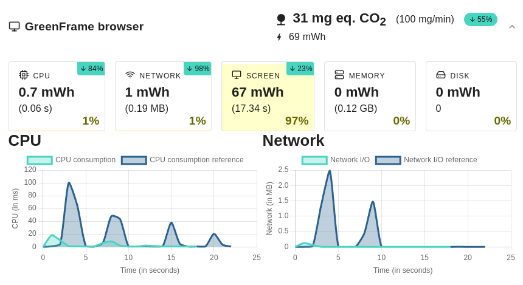
__Fig.5__ : Consommation de ressources par le navigateur lors de la consultation de la page des titres dans notre prototype.

Par ailleurs, il nous est possible désormais d'évaluer l'impact écologique de la partie "serveur", possiblement hébergée par un *data center* (cf. Fig.6).
Réduite au simple hébergement de données statiques sur un serveur Web, cette partie a pour l'instant un impact très faible et quasi négligeable par rapport à la partie "client" . 

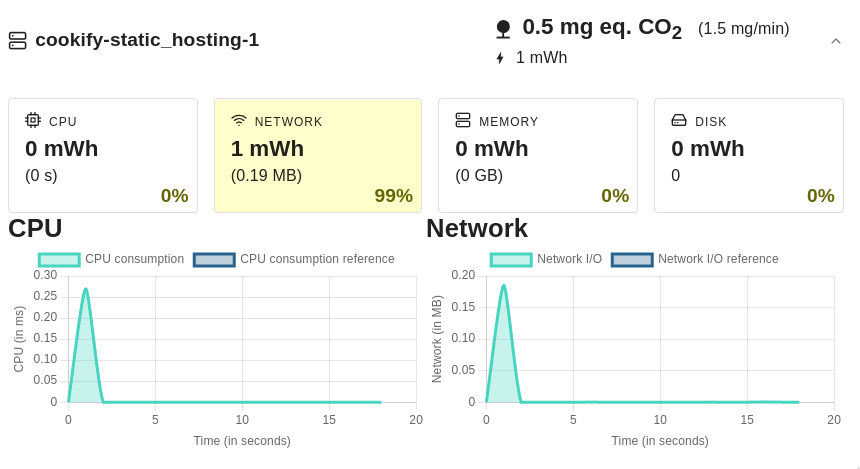
__Fig.6__ : Consommation de ressources par le serveur Web lors de la consultation de la page des titres dans notre prototype.

## Prototype n°3 : Fonctionnalités pour le scénario prioritaire avec données stockées dans une base de données

Pour la troisième version du prototype, nous avons décidé de migrer le stockage des données vers une base de données dynamique (CouchDB), interrogeable via une API Web. Cette migration présente deux avantages majeurs : une plus grande facilité de mise à jour des recettes et la possibilité de déporter sur le serveur le filtrage des données pertinentes. Cette évolution permet non seulement de rendre la maintenance des données plus efficace, mais aussi de réduire les impacts sur le client (frontend) en évitant des chargements non nécessaires.

**Analyse des résultats GreenFrame**

Nous avons effectué une analyse de l'empreinte carbone de notre prototype n°3 à l'aide de l'outil GreenFrame, qui permet d'évaluer avec précision la consommation énergétique des différentes interactions au sein de notre application. Voici un résumé des résultats obtenus :

**Résultats Généraux**

Consommation de CO₂ estimée 

- 57 mg de CO₂ par minute, ce qui représente environ 29 g pour 1000 exécutions du scénario principal.

Consommation énergétique totale : 
- 135 mWh

principalement due aux composants suivants :
- Écran : 92 mWh (soit 68% de la consommation totale).
- CPU : 30 mWh (22%).
- Réseau : 10 mWh (7%).

Scénario : Consulter la section "Sport"

- Consommation par minute : 98 mg de CO₂.
- Par exécution :31 mg de CO₂.
  
- Consommation par composant :
  
  - CPU : 9 mWh (25% de la consommation totale).
  - Réseau : 8 mWh (20% de la consommation totale).
  - Écran : 60 mWh (55% de la consommation totale).

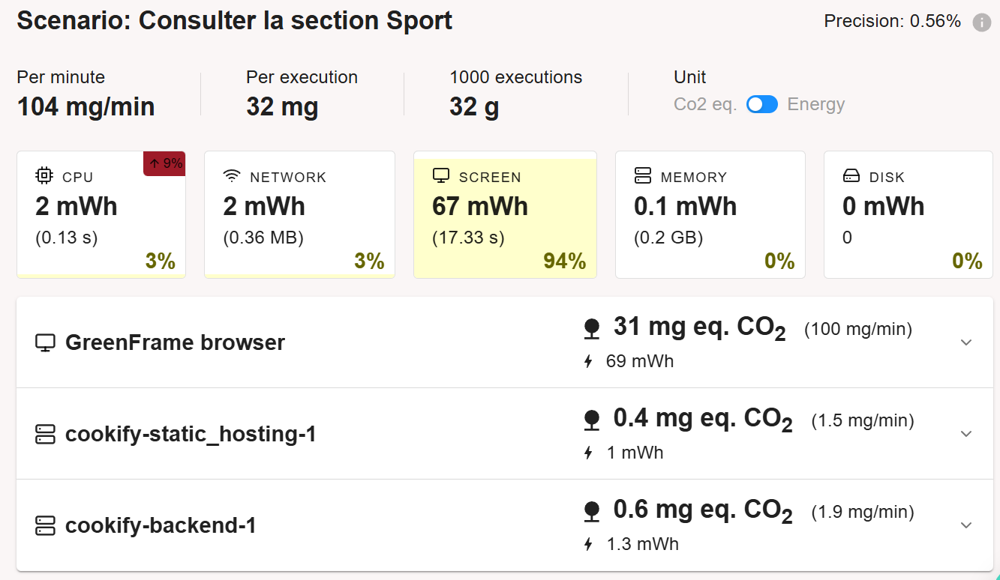
__Fig.7__: Consulter section sport Proto 3
  
Scénario : Consulter une recette

- Consommation par minute : 95 mg de CO₂.
- Par exécution : 29 mg de CO₂.
  
- Consommation par composant :

  - CPU : 8.5 mWh (23%).
  - Réseau : 7 mWh (19%).
  - Écran : 65 mWh (58%).

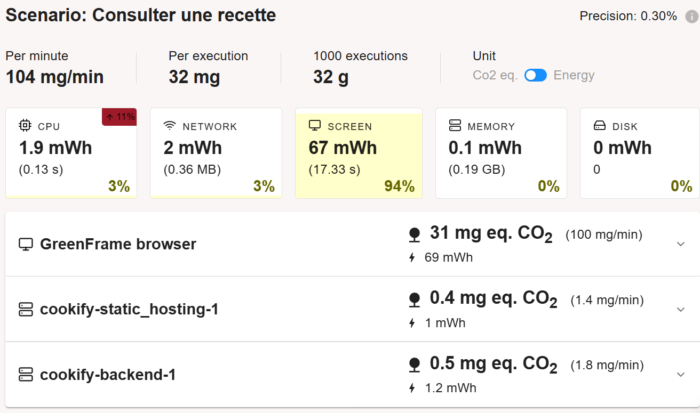
__Fig.8__: Consulter une recette proto V3
    
**Différence entre les scénarios : Consulter la section "Sport" vs Consulter une recette**

Les deux scénarios ont des impacts similaires, mais il existe des différences notables dans la répartition de la consommation énergétique :

- Écran : Dans les deux scénarios, l'écran reste la source principale de consommation énergétique, représentant 55% à 68% de la consommation totale. Toutefois, l'impact lié à l'écran est légèrement plus élevé lors de la consultation d'une recette (65 mWh contre 60 mWh), ce qui peut être dû au temps supplémentaire nécessaire pour lire les détails de la recette.

- CPU et Réseau : La consultation de la section "Sport" a une consommation plus élevée en CPU et en réseau (respectivement 9 mWh et 8 mWh) par rapport à la consultation d'une recette. Cela s'explique par le fait que la page de la section "Sport" nécessite probablement plus de ressources pour charger un grand nombre de recettes en une seule fois, tandis que la page d'une recette individuelle se concentre sur un seul élément.

**Comparaison entre Prototype n°2 et Prototype n°3**

Dans le prototype n°2, les données étaient chargées de manière statique depuis un fichier local. Cela présentait certains avantages, notamment une faible consommation liée aux requêtes réseau, puisque toutes les données étaient déjà disponibles côté client. Toutefois, cette approche rendait la mise à jour des données plus complexe et impliquait un chargement initial potentiellement plus long.

- Consommation réseau : Très faible, car les données étaient locales.
- Consommation CPU : Le CPU était principalement sollicité lors du chargement initial des données.
- Flexibilité : La mise à jour des recettes nécessitait une modification manuelle du fichier de données, ce qui limitait la flexibilité du prototype.

Avec le prototype n°3, nous avons migré vers une base de données CouchDB interrogeable via une API. Cette évolution a permis de rendre les données plus dynamiques, facilitant ainsi les mises à jour et le filtrage côté serveur. Toutefois, cette migration a introduit une consommation réseau plus élevée en raison des requêtes API nécessaires pour récupérer les données.

- Consommation réseau : En hausse par rapport au prototype n°2, en raison des requêtes pour récupérer les données depuis la base.
- Consommation CPU : Une légère augmentation du CPU a été observée, liée au traitement des requêtes et à la gestion des réponses JSON.
- Flexibilité : Le passage à une base de données dynamique offre une grande flexibilité pour ajouter, supprimer ou modifier des recettes sans intervention côté client.

## Prototype n°4 : Évolution avec une mise à l'échelle des données

Pour cette version du prototype, nous avons effectué une mise à l'échelle des données en passant de 25 recettes à 3000, afin de simuler un usage équivalent à plusieurs mois d'utilisation. L'objectif était d'évaluer l'impact de cette augmentation significative des données sur la consommation énergétique de notre application, notamment pour comprendre comment le backend (CouchDB) et le frontend géraient ce changement de volume.

**Analyse des Résultats GreenFrame**

Les résultats de l'analyse GreenFrame pour le prototype n°4 montrent un impact énergétique significativement plus élevé par rapport au prototype n°3 (fig 9). Le passage à 3000 recettes a permis de mieux comprendre l'effet de la mise à l'échelle des données sur la consommation des différents composants de l'application.

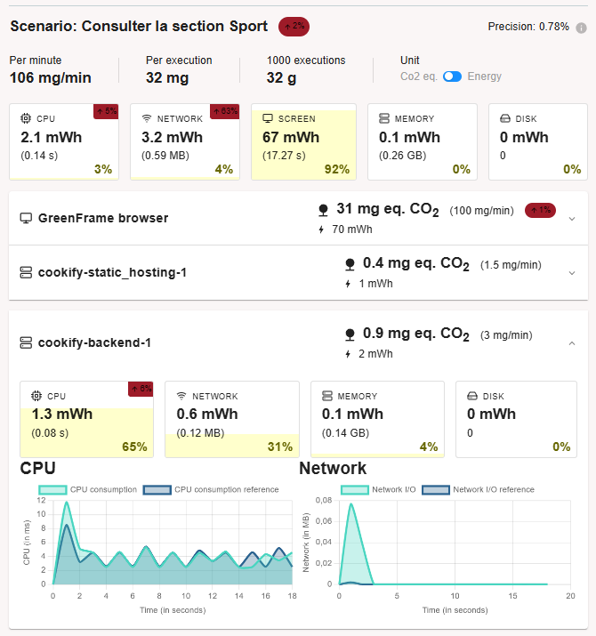
__Fig.9__: Consulter une Section Proto V4

Voici un résumé des résultats :

**Comparaison entre Prototype n°3 et Prototype n°4**

Prototype n°3 : Les données étaient stockées dans CouchDB, mais en quantités limitées à 25 recettes. La consommation énergétique était relativement faible, avec une consommation globale estimée à 64 mg eq. CO₂ par minute (144 mWh).

Prototype n°4 : Avec 3000 recettes, l'impact global est passé à 295 mg eq. CO₂ par minute, soit une augmentation considérable de la consommation, en particulier pour le backend qui gère les requêtes de consultation de la base de données. Voici les détails :

Consulter la section "Sport" :

- CPU : Consommation de 2.1 mWh (3% du total).
- Réseau : Consommation élevée à 3.2 mWh, soit 4% de l'énergie totale.
- Écran : Toujours la composante majeure avec 67 mWh (92%).

Consulter une recette :

- CPU : Consommation de 1.9 mWh.
- Réseau : Consommation de 2 mWh.
- Écran : 68 mWh (94%), légèrement supérieure à la consultation de la section.

Les graphiques montrent également l'évolution de l'impact énergétique du backend (CouchDB), où l'utilisation du CPU a augmenté de plus de 242% par rapport au prototype précédent.

**Principales Sources d'Impact**

L'analyse des résultats indique que l'écran reste la principale source d'impact, représentant en moyenne plus de 90% de la consommation énergétique totale. Avec l'augmentation des données, nous constatons que :

- Réseau : L'impact du réseau a considérablement augmenté, en raison des requêtes plus nombreuses et plus volumineuses pour interroger la base CouchDB avec 3000 articles.
- CPU : La sollicitation du CPU a augmenté également pour traiter l'ensemble des données, notamment du côté du backend.

Ces impacts sont liés principalement au volume élevé de données à gérer et à l'évolution de la complexité des opérations.
